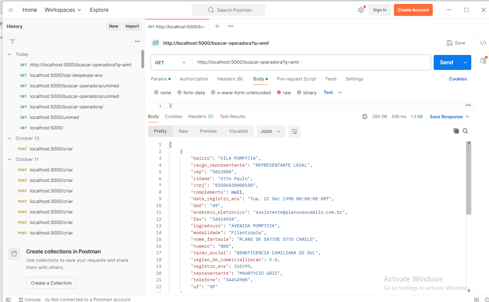

# IntuitveCare-Nivelamento
Teste de Nivelamento para Vaga de Estagio Intuitive Car


# Para executar o projeto use o comando 

Instale o docker compose e use o comando

``` docker compose up -d --build```

Depois abra o cmd e digite esse comando 

```docker exec -i mysql-dev mysql -u usuario -psenha --local-infile=1 meu_banco < ./initdb/queries.sql```

Ele fara com que carregue os valores cvs trimestrais dentro do banco de dados

Depois acesse localhost:5173


A opção de upload de csv não esta funcional

# Postman


